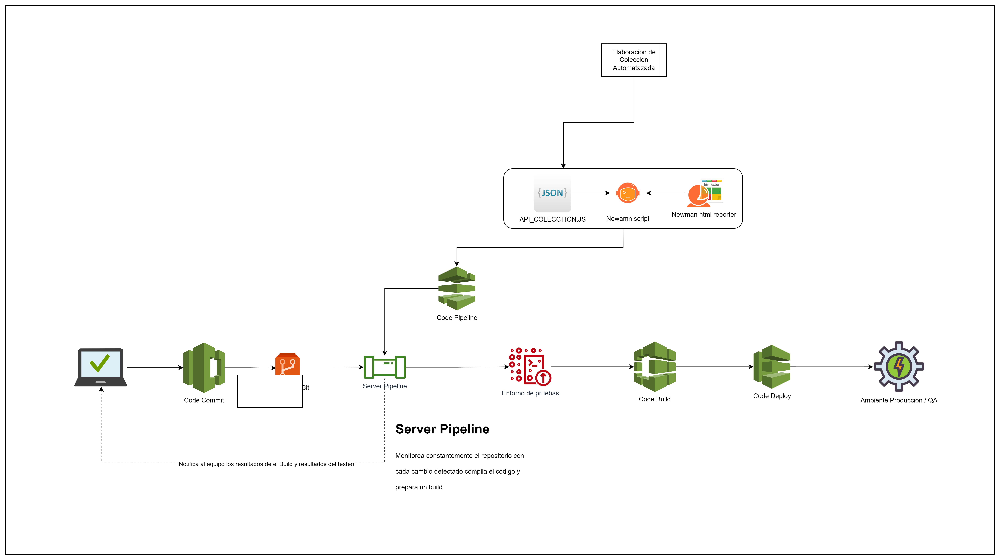

# 🚀 AUTOMATIZACIÓN DE PRUEBAS A SERVICIOS WEB  
## RESTFUL - BOOKER 📋

### 📌 Descripción del Proyecto
Este proyecto tiene como objetivo la **automatización de pruebas** de los servicios web proporcionados por **RESTFUL Booker**, asegurando la validación completa de los Endpoints **Auth, Booking, y Ping**. El flujo de pruebas está integrado en un **pipeline de CI (GitHub Actions)** para una ejecución continua y confiable. 

### 📁 Alcance de las Pruebas:
- Creación de pruebas para los Endpoints:
  - **Auth**
  - **Booking**
  - **Ping**
- **Automatización completa** de métodos HTTP:
  - **POST**, **GET**, **PUT**, **PATCH**, **DELETE**.
- **Integración continua (CI)** usando GitHub Actions.

---

### 🌐 Pipeline de CI/CD
El pipeline de CI está completamente automatizado usando **GitHub Actions**, ejecutando las pruebas cada vez que se realiza un **push** o una **pull request**. El flujo de ejecución está representado gráficamente en el siguiente diagrama:



- El pipeline garantiza que todas las pruebas se ejecuten en menos de **5 minutos**.
- Se logra un **100% de éxito en casos críticos** y una **cobertura mínima del 90% de los endpoints**.

### 📦 Ejecución de Pruebas Automatizadas con GitHub Actions

Este proyecto utiliza **GitHub Actions** para ejecutar las pruebas automatizadas de la API RestFul Booker a través de **Newman**.

- Las pruebas se ejecutan automáticamente con cada push o pull request en la rama `main`.
- Utilizamos el reporter **htmlextra** para generar un reporte HTML detallado de los resultados.

#### 🚀 Artifacts

Al finalizar la ejecución, se genera un **artifact** llamado `newman-report`, que contiene un resumen completo de la ejecución de las pruebas. Este archivo HTML incluye:

- Casos fallidos
- Tiempos de respuesta
- Detalles de la ejecución de cada request

Puedes encontrar el archivo en la sección de **Artifacts** del workflow en GitHub Actions.

#### Ejemplo de Configuración del Workflow

El archivo de configuración del workflow utiliza **Newman** para ejecutar la colección de Postman con el siguiente paso clave:

```yaml
- name: Run collection with htmlextra reporter
  run: newman run ./postman/RESTFUL_BOOKER_AUTOMATE.postman_collection.json -r htmlextra --reporter-htmlextra-export newman-report.html
  ```
---

### 🔧 Herramientas y Tecnologías

- **Postman**: Para la creación de pruebas automatizadas.
- **Newman**: Ejecución de las pruebas desde la línea de comandos.
- **GitHub Actions**: Para la integración continua y automatización del pipeline.
- **Visual Studio Code**: Para edición de scripts y configuraciones.

---

### 📜 Casos de Prueba

El proyecto cuenta con un total de:

- **54 requests**, que equivalen a **54 casos de prueba**.
- **170 assertions** en total.
- Todos los **casos críticos** tienen un éxito del **100%**.
- **Duración total** de ejecución: **10.6 segundos**.
- **Promedio de respuesta**: **130 ms**.

📊 **Resumen de resultados**:

| **Ítem**            | **Total** | **Failed** |
|---------------------|-----------|------------|
| **Requests**        | 54        | 0          |
| **Prerequest Scripts** | 36     | 0          |
| **Test Scripts**    | 43        | 0          |
| **Assertions**      | 170       | 25         |
| **Skipped Tests**   | 0         | -          |

El promedio de datos recibidos en cada ejecución fue de **86.89 KB**. Algunos assertions fallidos son gestionados para pruebas negativas y validaciones de errores controlados.

---
### 🖥️ Ejecución Local del Proyecto

Para correr las pruebas localmente utilizando **Newman**, hemos creado un batch file que facilita el proceso de ejecución.

#### 📝 Requisitos previos

1. **Instalación de Node.js**  
   - Asegúrate de tener [Node.js](https://nodejs.org/) instalado.

2. **Instalación de Newman**  
   - Ejecuta el siguiente comando en la terminal para instalar Newman globalmente:
     ```bash
     npm install -g newman
     ```

#### 🚀 Ejecución de Pruebas
Para correr las pruebas de manera local, simplemente ejecuta el archivo batch `Run_Automation.bat` que se encuentra en la raíz del proyecto. 

🔄 **Durante la ejecución**, verás un mensaje de progreso dinámico indicando que se están ejecutando las pruebas.

Al finalizar, se generará un **reporte HTML en la carpeta `newman`** con los resultados de la ejecución.

---

📂 **Revisión del Reporte**  
Una vez finalizadas las pruebas, puedes revisar el **reporte generado en la carpeta `newman`**. Se mostrará un mensaje en la consola para que consultes los detalles del resultado.

---

🚀 **Criterios de Éxito**  
- **100% de casos críticos exitosos**.
- **Cobertura mínima del 90%** de los endpoints automatizados.
- **Tiempo de ejecución máximo**: 5 minutos.

**Resultados Promedio**:
- **Duración total**: 10.6s
- **Datos recibidos**: 86.89KB
- **Promedio de respuesta**: 130ms

---

🤝 **Contribuciones**  
¡Las contribuciones son bienvenidas! Si tienes sugerencias o mejoras, no dudes en crear un **pull request** o abrir un **issue**.

---

👨‍💻 **Autor**  
El proyecto de automatizacion de pruebas de API y configuracion del Pipeline fue desarrollado por **Emmanuel Salazar Revoredo** 
El codigo fuente de la API y Resquest de las API pertenecen Mark Winteringham de su repositorio [RESTful-Booker](https://github.com/mwinteringham/restful-booker)

---

📜 **Licencia**  
Este proyecto está bajo la licencia **MIT**.
